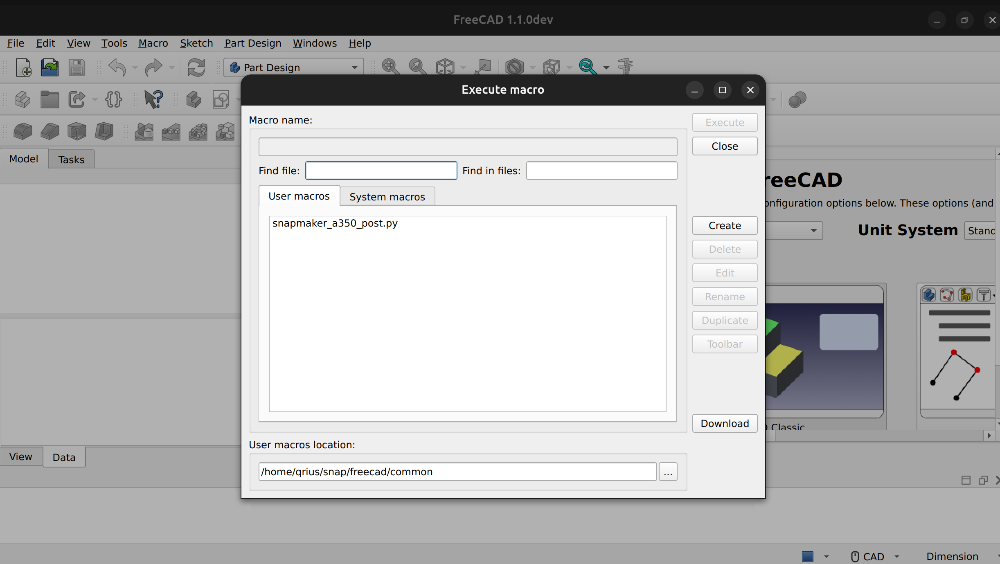

Generate G-code Using FreeCAD
===============
This instruction teaches you how to carve hexagons on a 2mm carbon fiber sheet. Once you are familiar with all the settings, you can design your own invention. For more details, please visit https://wiki.freecadweb.org/User_hub

## Getting Started

This software is available for Windows, Linux, and Mac. Since the configuration for both systems is similar, here in this instruction, we take steps in Windows as an example. 
Linux systems do require some variation as the path used for custom post_processors is different

### Step 1. Get the Software Ready

Install the software and save the configuration files according to the following steps:

1. Download and Install FreeCAD at https://www.freecadweb.org/.
2. Select the **Path workbenches** and click **tool manager** to import the [Snapmaker-2.0-CNC-Tools.json](./Snapmaker-2.0-CNC-Tools.json). NOTE: It is recommended to add more custom tool options for a more complete selection of tools
3. Copy [snapmaker_(model)_post.py](./snapmaker_a350_post.py) to the PostScripts or Macros folder to add the postprocessor to FreeCAD
    - Windows :: C:\Program Files\\${FreeCAD Path}\Mod\Path\PathScripts\post 
    - Ubuntu : Snap release :: ~/snap/freecad/common
    - Debian/AppImage release :: ~/.local/share/FreeCAD/Macro
    - More FreeCAD path post details on the https://wiki.freecadweb.org/Path_Post
    - To make more modifications to customize the post_processor, https://wiki.freecad.org/CAM_Postprocessor_Customization#Naming_convention
4. Alternately, if using Linux you can use the command "python [setup_freecad.py](./setup_freecad.py)", which will try to detect where the correct folder is and copy the desired post_processor to that location

### If you can't find your macros folder:
1. Go into FreeCAD and open the Macro tab at the top. Click "Macros ..." to open the Macros window 
2. Click Create. This will open a text window to input the code
3. Option A: You can copy and paste the code from [snapmaker_(model)_post.py](./snapmaker_a350_post.py) into the window and save it under the name [snapmaker_(model)_post.py](./snapmaker_a350_post.py)
4. Option B: if using Linux, you can save the name as something very unique. 
Then, in a separate terminal, 
1. Go to the root folder "cd /"
2. then use the command "find -name 'name' | grep 'name'". 

This will search your whole system for the file. The list will be hard to read, but this should highlight lines that contain the 'name' you put in, making it easier to read. You can then copy and paste the post_processor you want directly into that folder.

### Step 2. Design the Model You Want to Carve

1. In FreeCAD, select **Part Design** as the Workbenches.
2. Create a new sketch and select the XY_Plane(Base plane).

3. First set the navigation style to CAD, and click  to create a regular polygon.When you finish editing, click   to close the editing of the sketch.

4. Click  and enter 2.00 mm in the Length field. Click OK.

### Step 3. Generate Tool-Path Strategies
1. Change the Workbenches to **Path**.
2. Click ,Selected body and Click OK.
 
    - Select **Output** and set Processor is snapmaker_freecad. 
       
    - Select **Tools** and click Add.Selected the **flat end mill (3.175 mm)** and click **Create Tool Controllers(s)** to add the tools.
    
    - Click OK.
3. Click  to create a contour and set the flat end mill tool.
    - Set the Step Down to 0.2mm
 
    - Click OK.
### Step 4. Generate G-code
1. Selected the **Job -> Operations -> Contour** and click  to post process.

2. Change the G-code name as you need, and save the G-code.

